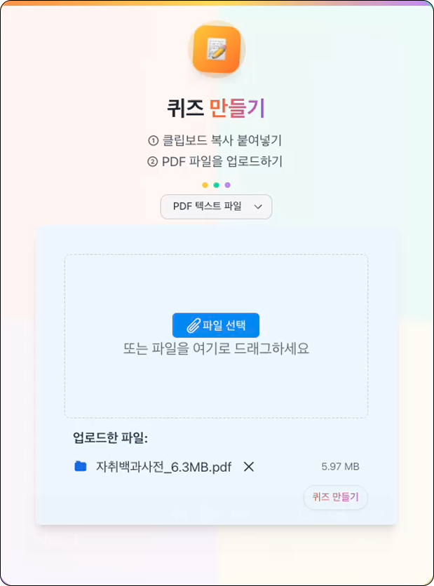
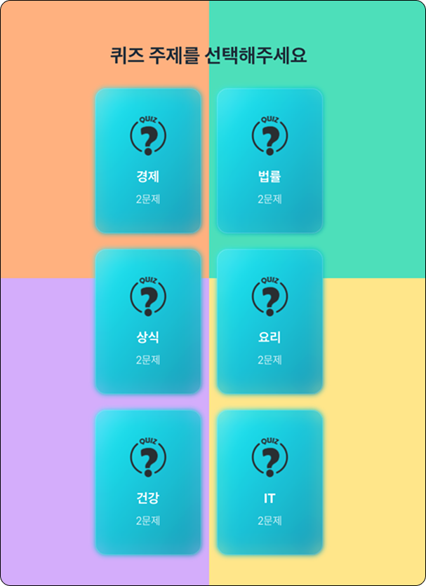
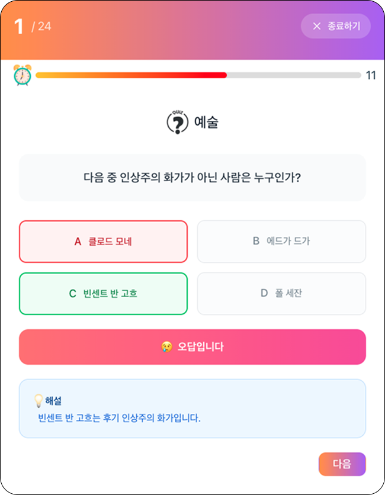
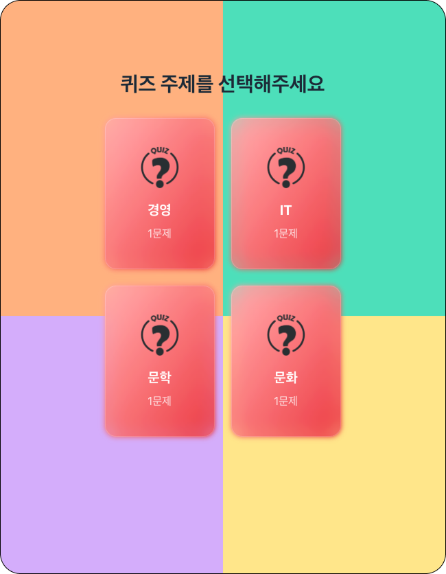
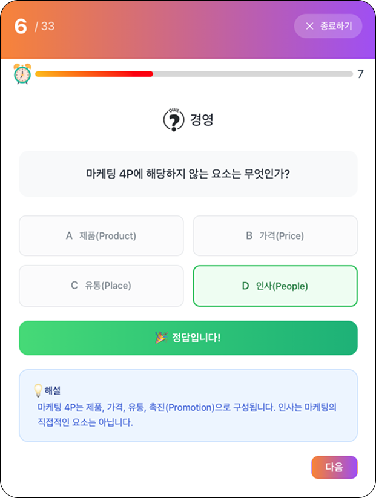
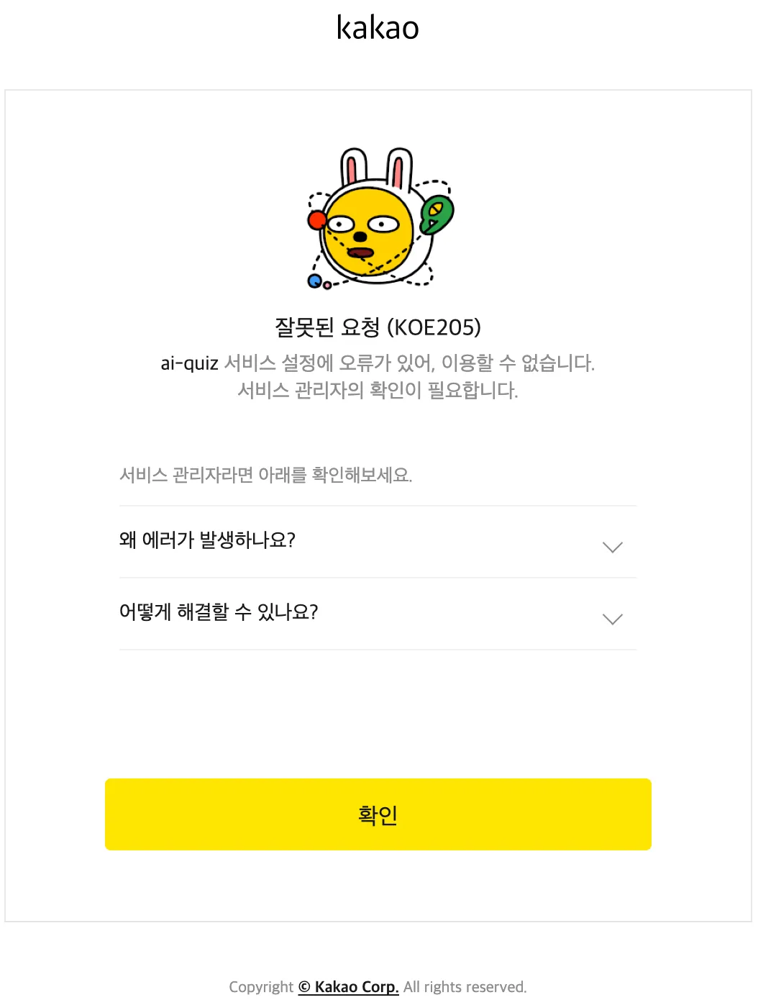
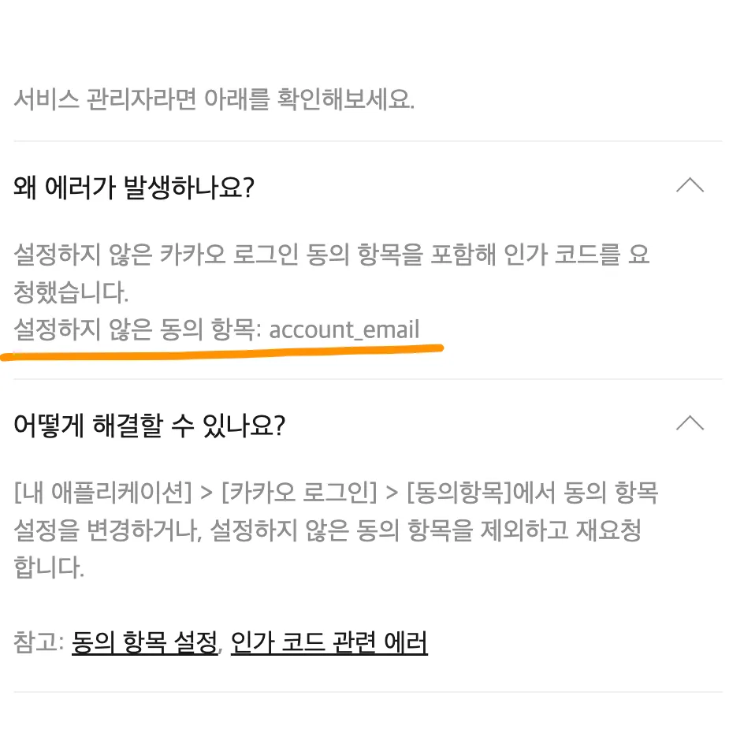
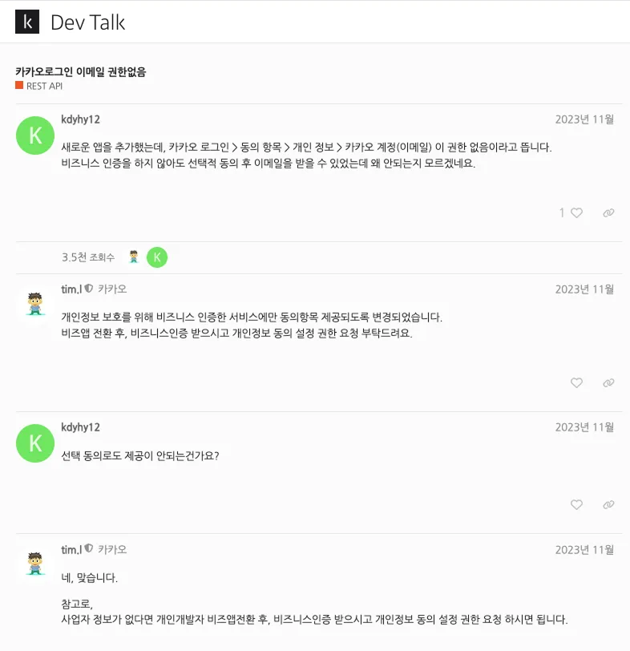
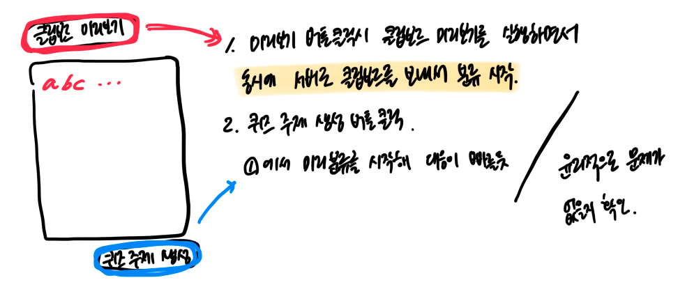

# GPTeacher

<div align="center">

  <p style='font-size:30px; color:#4870fc'>GPTeacher</p>
  <p>
    우리는 매일 AI와 함께 숨 쉬듯 방대한 정보를 소비합니다.<Br>
    하지만, 단순한 소비를 넘어 직접 만든 콘텐츠로 학습을 이끌어갈 수는 없을까요?</p>
</div>

<Br>
<Br>
<Br>

# 프로젝트 소개

GPTeacher 프로젝트는 **생성형 Ai**를 활용해 사용자가 PDF 파일 혹은 제공한 텍스트 내용을 기반으로 맞춤형 퀴즈를 제작해주는 학습 플랫폼입니다. 정보 소비를 넘어 정보 생산에 기반한 학습이라는 새로운 학습 경험을 제공합니다.

생성형 Ai와의 대화 내용을 사용자가 직접 제공함으로써 AI를 통해 퀴즈로 변환되고, 이를 주도적으로 학습 콘텐츠로 활용하여 효과적으로 체화해보는데 의의를 두고 있습니다.
<br>
<br>
<br>
<br>

# 링크

<div align="center">

[서비스 페이지](https://gp-teacher.vercel.app/) | [깃허브 레포지토리](https://github.com/Ai-daily-quiz/Ai-quiz)

</div>

<br><br><br>

# 목차 📖

- [프로젝트 소개](#프로젝트-소개)
- [링크](#링크)
- [핵심 기능](#핵심-기능)
  - [AI 기반 퀴즈 생성](#ai-기반-퀴즈-생성)
  - [개인화된 학습 관리](#개인화된-학습-관리)
- [기술 스택](#기술-스택)
  - [Client](#client)
  - [Server](#server)
  - [Deployment](#deployment)
- [기능 구현 및 챌린지](#기능-구현-및-챌린지)
  - [카카오 oAuth와 KOE205 에러](#카카오-oauth와-koe205-에러)
  - [드래그 앤 드랍](#드래그-앤-드랍)
  - [타이머](#타이머)
  - [Background Processing](#background-processing)
- [회고](#회고)
  <br><br><br>

# **핵심 기능**

사용자가 입력한 텍스트 또는 PDF 문서를, Ai가 분석하여 주제별로 분류하고 퀴즈를 생성해 효율적으로 복습하고 쉽게 자신만의 학습 콘텐츠를 제작할 수 있습니다. 과정을 통해 사용자는 자신만의 콘텐츠를 체계적으로 복습할 수 있으며, 학습의 밀도와 효율을 동시에 높일 수 있습니다.,

<br>

> ## **Ai 기반 퀴즈 생성**

- 사용자는 텍스트나 PDF 파일을 업로드하여 LLM(대규모 언어 모델, Large Language Model)(작은 텍스트 font) 을 통해 분석 및 퀴즈 생성을 요청할 수 있습니다.
- 파일 업로드 시 로그인 사용자는 최대 50MB까지, 비회원 사용자는 최대 10MB까지 업로드 가능합니다.
- AI가 생성한 객관식과 OX 퀴즈는 사용자에게 카드 형식의 직관적인 인터페이스로 제공합니다.
- 사용자는 원하는 주제를 선택하고 해당 주제에 따른 퀴즈를 풀 수 있습니다.

<table>
  <tr>
    <td align="center">
      <br>
      <b>⓵ PDF 업로드</b>
    </td>
    <td align="center">
      <br>
      <b>⓶ 퀴즈 생성</b>
    </td>
    <td align="center">
      <br>
      <b>⓷ 퀴즈 풀기</b>
    </td>
  </tr>
</table>

<br><br><br>

> ## **개인화된 학습 관리**

- 서비스는 로그인한 사용자의 중간에 중단한 퀴즈나, 틀린 퀴즈를 저장해 이어서 학습할 수 있도록 도와줍니다.
- 이전에 풀던 문제를 다시 시작할지, 새로운 문제로 시작할지 선택할 수 있습니다.
- 틀린 문제를 중심으로 복습할 수 있어, 반복 학습을 통해 학습 효과를 극대화할 수 있습니다.

<table>
  <tr>
    <td align="center">
      <br>
      <b>⓸ 틀린 퀴즈 풀기</b>
    </td>
    <td align="center">
      <br>
      <b>⓹ 틀린 퀴즈 풀기</b>
    </td>
  </tr>
</table>

<br><br><br>

# **기술 스택**

<br>

## **Client**

<p>
  
  
  
  
</p>
<br>
<br>

## **Server**

<p>
  
  
  
  
  
  
  
</p>
<br>
<br>

## **Deployment**

<p>
  
  
</p>
<br><br><br><br>

# **기능 구현 및 챌린지**

<br>
<br>

> ## 카카오 oAuth와 KOE205 에러

Supabase Provider에 카카오톡을 등록하기 위해 kakao developers에서 발급받은 카카오 API Key, Secret code 와 콜백 url을 설정합니다.

```jsx
const handleKakaoLogin = async () => {
  const { data, error } = await supabase.auth.signInWithOAuth({
    provider: 'kakao',
    options: {
      scopes: ['profile_nickname', 'profile_image'],
      redirectTo: import.meta.env.VITE_REDIRECT_URL || window.location.origin,
    },
  });
  if (error) console.error('로그인 에러:', error);
};
```

그런데 소셜 로그인을 실행하면, KOE205 에러를 마주하게됩니다.

---

<Br>
<details>
  <summary><strong style="font-size:20px">💥 카카오 로그인 에러 KOE205 ?</strong></summary>
  <br/>
  <table>
    <tr>
      <td align="center">
        <br>
        <b>⓸ 틀린 퀴즈 풀기</b>
      </td>
      <td align="center">
        <br>
        <b>⓹ 퀴즈 풀기</b>
      </td>
    </tr>
  </table>
</details>

카카오 소셜 인증과 관련해서 [Supabase 공식문서](https://supabase.com/docs/guides/auth/social-login/auth-kakao)에서 다음과 같이 설명하고 있습니다.

```
Set following scopes under the "Consent Items": account_email, profile_image, profile_nickname
```

기본값으로 **account_email** 을 scope로 요청한다는 것입니다. 개인정보 중 account_mail 을 제어하기 위해 카카오 디벨로퍼에서 절차들을 따라야했습니다.

<br>

---

<br>
<details>
  <summary><strong style="font-size:20px">💁‍♀️ 먼저 다녀간 선배의 발자취 </strong></summary>
  <br/>
  <table>
    <tr>
      <td align="center">
        <br>
        <b>선배님의 문의 in 카카오 디벨로퍼</b>
      </td>
      <td align="center">
        <br>
        <b>내 문의</b>
      </td>

  </table>
</details>
<br>
  먼저 카카오 디벨로퍼 게시판에서 찾은 내용은 개인정보 보호를 위해 동의항목 제공방식이 바뀌었다는 내용이었습니다. 그리고 다시 2년사이에 설정방식에 다른 변화가 있었지만 문의로 적절한 답을 찾을 수 있었습니다.

  <br>
  인증을 완료하면 account_email 동의항목이 활성화됩니다. 상태를 설정해주고 다시 요청해 카카오 소셜 로그인을 구현할 수 있었습니다. 구글 소셜 로그인도 진행했었는데, 공통적으로 필요로 하는 정보도 있는 반면, 플래폼마다 요구하는 정보가 다를 수 도 있다는 사실을 알게됐습니다. 애플 로그인도 추가할 계획을 가지고 있는데 이 경험 많은 도움이 될거라는 생각이 들었습니다.
    </tr>

<br>

---

<br><br><br>

> ## 드래그 앤 드랍

드래그 앤 드롭은 직관적이고 사용 편의성이 뛰어난 파일 업로드 방식 중 하나입니다. 해당 기능은 react-dropzone 라이브러리를 활용하여 구현하였습니다.

react-dropzone 라이브러리를 통해 훅 useDropzone 가 반환하는 객체로부터 `getRootProps`, `getInputProps`, `isDragActive` 프로퍼티들을 사용할 준비를 합니다.

또한, multiple과 accept 속성을 통해 사용자가 업로드할 수 있는 파일의 수와 형식을 제한하였으며, 저는 단일 PDF 파일만 허용하도록 설정했습니다.

```jsx
const { getRootProps, getInputProps, isDragActive } = useDropzone({
  accept: {
    'application/pdf': ['.pdf'],
  },
  multiple: false,
  onDrop: acceptedFiles => {
    if (acceptedFiles.length > 0) {
      const uploadedFile = acceptedFiles[0];
      setFile(uploadedFile);
      setUploadFile(uploadedFile);
    }
  },
});
```

`onDrop`은 첫번째 매개변수로 acceptedFiles 전달받는 콜백함수입니다. 전달받은 단일 파일인 acceptedFiles[0] 을 setState를 통해 전역에 저장했습니다. 그리고 새 `FormData` 를 만나 서버로 보내질 준비를 합니다.

`getRootProps` 프로퍼티는 마우스로 드래그를 놓는 영역 div에 이벤트 핸들러와 속성들을 만들어주는 객체입니다 . 그리고 `isDragActive` 를 통해 파일드롭 놓을 영역에 대한 시각적 피드백을 제공하도록 했습니다.

개인적으로 이러한 요소들이 드래그 앤 드롭 기능을 더 역동적으로 만들어주는 요소라고 생각했습니다.
<br><br><br>

> ## 타이머

⏰ 게임처럼 즐기는 퀴즈, 타이머 구현기


<br>
<br>

퀴즈를 푸는 시간에 제한을 두는 기능을 구현했습니다. 퀴즈를 단순히 '푸는 것'이 아니라 '도전하는 것' 게임같은 재미 요소를 주고 싶었고, 시간 제한이 주는 긴장감을 통해 학습에 몰입도 올라가지 않을까 생각했습니다.

타이머, 프로그래스바 라이브러리들을 찾기 시작했습니다. 시간이 동적으로 줄어드는 흐름을 보여주고싶었는데 조사한 라이브러리들은 원형디자인에 로딩 상태를 표현하는데 맞춰져있었습니다. @ramonak/react-progress-bar 는 transitionDuration 프로퍼티로 프로그래스바가 움직이는 시간을 설정해 시간이 흐르는 것처럼 만들어줬고 정확히 제가 찾던 방식이었습니다. 어릴적 오락실에서 즐겨했던 틀린그림찾기와 스트리터파이터 게임으로부터 남은 기회 혹은 체력을 유저에게 알려주는 방식을 오마주했습니다. 좌측에서 우측으로 시간, 체력 게이지(버킷)가 줄어드는 것을 시각적으로 보여주다가 게이지가 얼마 남지 않았을때 적색으로 보여주는 방법입니다. 별것 아닐 수 있지만, 가성비가 아주 좋은 긴장감을 만들어줬던 것 같아서 꼭 적용하고 싶었습니다.

```javascript
<ProgressBar
  key={questionIndex}
  className="ml-1"
  completed={progress}
  maxCompleted={100}
  height="10px"
  width="550px"
  borderRadius="50px"
  isLabelVisible={false}
  baseBgColor="#dcdcdc"
  bgColor="linear-gradient(to right, #ffc700, red)"
  transitionDuration={isSubmitted ? '0s' : `${quizLimitSec}s`}
  transitionTimingFunction="linear"
  animateOnRender={true}
/>
```

구현 과정에서 버그들이 많았는데,
프로그래스바는 100%가 됐지만 시간은 계속 올라가거나, 다음 문제로 이동하면 시간이 초기화되지 않거나, 다음 문제 시작과 동시에 시간 게이지가 뒤로 이동하는 현상 등이 있었습니다. 상태관리와 transition 설정의 문제들이었는데 전달하는 속성들과 setState를 새로 전달해 다음 문제시에 새로운 게이지를 시작하도록 처리했습니다.

<br>
<br>
<br>

<br><br><br>

> ## Background Processing

사용자가 '퀴즈 만들기' 버튼을 누르고 퀴즈가 생성되기까지 평균적으로 20-30초가 소요됩니다. 퀴즈 생성은 핵심기능인만큼 사용자가 기다려야하는 시간을 절대적으로 줄이는 여러가지 방법을 찾아보면 좋겠다는 생각이 들었습니다. **"버튼을 누르기 전에 사용자의 입력 단계에서 서버로 미리 데이터를 전송하고 분석을 시작하면 안될까?"** 하는 궁금증이 들었습니다. 곧 '퀴즈 생성 버튼'를 누르지만, 생성이 완료되었다면 퀴즈를 보여주고 아직 진행 중이라면 로딩화면을 유지하는 구조로 사용자가 조금이라도 기다리는 시간을 줄일 수 있을 것 같았습니다.

<Br>



<br>

동시에 사용자의 동의 없이 미리 데이터를 서버로 전송하는 것은 문제가 없을까 의문점도 들었습니다. 그래서 **윤리적으로 문제가 없을지 사례를 찾아봤습니다.**
you-tube, netflix 영상을 클릭하기 전 호버만해도 영상이 로드 되는 pre-fetch / pre-load 기술과 비슷한 것 같았으나, 저는 사용자의 입력데이터를 미리 처리하는 것이기 때문에 맥락이 조금 달랐습니다. 실서비스로부터 힌트를 얻고자 고민하는 시간을 보내다 문득 자주 사용하는 번역기의 패턴이 생각났습니다. 텍스트를 타이핑하는 중간에 실시간으로 번역해주는 것. 그것과 같은 패턴일 것 같다는 생각이 들었습니다. <br><br>
실제 서비스하는 것의 사례와 패턴을 이해하니, 더 많은 서비스들이 보였습니다. 검색엔진에서 텍스트를 타이핑하는 중간 연관검색어 제시, 구글 스프레드시트의 자동 저장 그리고 **구글 포토에 사진을 업로드하면 AI가 사진 분석을 시작하는 서비스** 등이 서버 측에서 선처리를 수행하는 방식이 충분히 설득력 있고 일반적인 패턴이라는 확신을 갖게 되었습니다.
여러 사례를 확인하며 해당 방식에 문제가 없는지 검토했고, 이를 찾아보는 과정 자체도 충분히 의미 있는 경험이었습니다.

<br><br><br>

# 회고

혼자 프로젝트를 진행하면서 협업에서 사용하는 방식들을 직접 적용해보며 연습할 수 있는 좋은 기회라고 생각했습니다.
AI 기반 코드 리뷰 도구를 활용해 코드 품질을 자가점검하고, GitHub에서 이슈를 생성하고 PR을 등록하며 협업 흐름을 시뮬레이션하며 진행해갔습니다.
속도는 분명 느렸지만, 이러한 과정과 개발 프로세스를 하나씩 갖춰가는 경험은 개발자로써 마땅히 갖춰야하는 기본이고 중요한 과정이라고 생각했습니다.

두 번의 프로젝트를 연달아 진행했지만, 그 과정에서 느낀 가장 큰 인사이트는 결국 ‘직접 부딪히고 경험하는 것’이 가장 빠른 성장의 길이라는 것이었습니다. 더 다양한 환경과 팀에서 협업하며 더 많은 경험을 쌓으며 개발 역량뿐 아니라 커뮤니케이션 능력, 문제 해결력까지 함께 성장시켜 나가고자 합니다.

<br>
